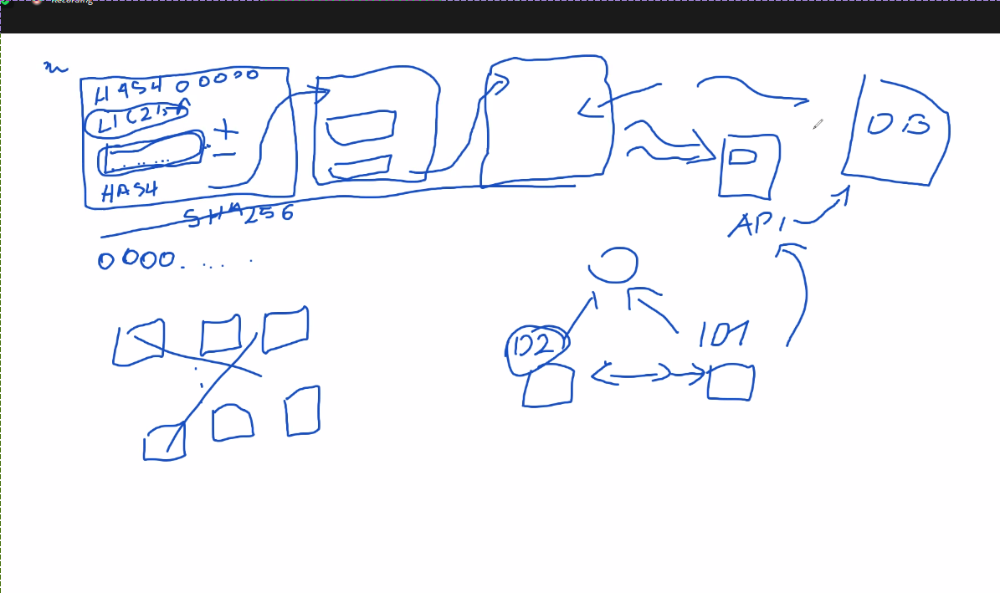

# Notatki ze spotkań z promotorem

## 21.10.2021 Ogólne spotkanie wstępne
### Praca Inżynierska
- krótkie 10min spotkania

### Praca domowa na przyszły tydzień:
- Spis treści,
- podział pracy.

Jeśli będzie zrobione: zacząć pisać wstęp -- lejek od ogółu do szczegółu (3str)
wyszczególniona podsekcja na tezę pracy. jednym zdaniem

- pan doktor działa zdarzeniowo
- mając raspberry można poćwiczyć
- na kompie zrobić uwierzytelnianie
- żółte światło
- link do overleafa

### Docker
docker -- rozwinąć serwer na kompie, węzły itd, węzły jako kolejne instancje otpalac na kompie
wysłanie na docelowe jednostki na koniec. spróbować bardzo szybko skonteneryzować (10 kontenerów) potem na raspberry, góra 2 raspberry, 10 kontenerów 
na za tydzień, podział pracy na rozdziały, bdb pisać wstęp...


### Moja rozmowa:
dzień dobry, bez owijania w bawełne mogę powiedzieć że że względu na pracę i praktyki podczas wakacji trochę odpuściłem tworzenie inżynierki, ale już skończyłem praktyki i mogę się zająć pisaniem i robieniem inżynierki. aktualnie postęp mojej pracy inżynierskiej stoi na poziomie takim, że nie skończyłem jeszcze projektu, udało się zrobić research na temat blockchainu i internetu rzeczy, zrobiłem prostą strukturę blockchain w pythonie, nie jest to jeszcze finalną wersja ale już jest jakiś zalążek. zatrzymałem się na punkcie robienia sieci IoT (komunikacja internetową). całość mam zamiar pisać za pomocą pythona bo trochę w tym siedziałem przy okazji praktyk i jakichś pobocznych projektów.

1. Przegląd materiałów na temat IoT, Blockchain,
2. Implementacja sieci IoT,
3. Stworzenie komunikacji pomiędzy węzłami, np. przy użyciu ZeroMQ,
4. Wysyłanie testowych danych pomiędzy węzłami,
5. Uwierzytelnianie węzłów w sieci za pomocą technologii Blockchain,
6. Testy sieci (uwierzytelnianie, prędkość komunikacji, dodawanie nowych węzłów),
7. Testy na realnym urządzeniu w sieci przy użyciu Raspberry Pi,

Cele pracy dalszej:
1. Przeprowadzanie ataków na sieć (podszywanie się pod inne węzły),
2. Interfejs webowy do wyświetlania,

na następny raz:
- wstęp napisać, 3str. z odwołaniami bibliograficznymi, lejek od ogółu do szczegółu.

Na przykład:
od momentu kiedy powstał internet zaczęła się wymiana danych ... podpisy, cerberosy, weryfikacja, nową technologia to blockchain, zalety, atuty, opisać projekt...
komunikacja
plus drugi rozdział, zacząć opisywać internet rzeczy. przy czym wstęp jak będzie opisany, (do weekendu), pan spojrzy na wstęp. drugi rozdział ciągnąć dalej, na następną turę żeby był.

docker, opiszemy w ten sposób. fajnie fizycznie będzie dodać weryfikację, dodamy testy itp.

## 04.11.2021
### Docker
```bash
docker network inspect nazwasieci
```
pula adresów, itp. potem przy tworzeniu konteneru:
```bash
docker --network
```

### Co nalezy zrobić?
Nie ma 51% zgodności itp, hash: 4 zera, numer magiczny: 1 int, mogę pracować na danych w środku blockchainu, JSON z listą dostępnych node'ów. Jak będzie więcej niż to 5 zapisuję w następnym bloku węzły dostępne w sieci, walidacja wygląda nastepująco, node stara się o dostęp do sieci, wysyła dane z numerem id do innego węzła dane które dostaję są uwierzytelnione, te węzły mogą się komunikować po sieci powinienem mieć serwer, który ma blockchain, serwer wystawia api, gdy węzeł o id1 dostanie dane z węzła sieci id2, muszę sprawdzić czy ten węzeł o id2 i kluczu dodatkowym (szyfrowanie asymetryczne), muszę zweryfikować czy id2 jest w sieci, odczytuje dane w węźle id1, pytam serwer z blockchaina czy id2 jest w blockchainie, wtedy słucham. Przeszukuję cały blockchain, i na jego podstawie tworzę bazę, w blockchainie może być kilkukrotnie węzeł dodany, odjęty, muszę to sprawdzić czy jest na 0, serwer jak dopisuje rzeczy do blockchainu, żeby wygenerować bazę danych muszę przeczytać wszystkie rzeczy, które są w blockchainie, to api odwołuje się do bazy danych, a nie do samego blockchaina. W blockchainie przetrzymuje modyfikacje o sieci. Potem po przetworzeniu tworzę bazę, blockchain porównuje do konta, są zasilenia i obciążenia, po zsumowaniu wychodzi saldo konta. Jak zrobię coś takiego u siebie, to będzie na prawdę fajnie.
Podstawowa wersja, pan chciałby żeby były 2 serwery przechowujące kopię.
Wzorzec między węzłami: klient-serwer, request - reply.
Serwer api -- http tcp/ip django lub flask.


## 12.11.2021
- Lista węzłów uwierzytelnionych,
- lepiej zrobić listę węzłów,
- nie wchodźmy w rozwiązywanie problemów implementacyjnych,
- symulacyjnie narazie, docker szybki, jak się uda to na fizyczne urządzenie wywalić.

## 09.12.2021
trochę przez ostatni tydzień chorowałem, narobiłem sobie zaległości na innych przedmiotach, ale to się już wyprostowuje
### Pytania:
- mam świadomość że termin wrzucenia pracy do asapu jest bodajże 07.01, ale kiedy tak realnie trzebaby skończyć pracę nad inżynierka?
    10 dni przed terminem żeby oddać domskiemu. Do 04.01 mamy czas żeby wysłać pracę. Około 24.12.

### Notatka z rozmowy
Pan by bardzo chciał żeby wrzucić to co jest na ostatnia chwilę. jest bardzo
zadowolony, 3.2 trzeba naprawdę rozwinąć. Algorytmy konsensusu bardzo ważne.
bez tego blockchain jest bez sensu. Użycie blockchainu w iot 2/3 artykuły
naukowe, struktura danych do wywalenia -- opisane w diagramie 3.2 skupić się
żeby pełna implementacja rozdziału 4. dokończyć cały rozdział 3. Do niedzieli,
3.2 i 3.4 wysłać. Jak będzie całe API pan domski chce żeby architektura sieci
pojawiła się w pracy flask API id itd. cały opis funkcjonalności ma się znaleźć
w całej pracy. Nie opisywać dokładnie, url -- opis odpowiedzialny za dodawanie
itp. to powinno dość sprawnie pójść, nieuniknione, musi się pojawić w pracy,
API flask musi być w dokumencie.

## 16.12.2021
### Pytania:
- przy robieniu researchu na temat konsensusu napotkałem na skierowane grafy
  acykliczne, czy w rozdziale o blockchain napisać podrozdział o DAG --
  directed acyclic graphs, skierowanych grafach acyklicznych (inną struktura
  danych)?
- czy przy podrozdziale użycie blockchainu w iot powinien się znaleźć obrazek/schemat mojej sieci? czy to wywalić do innego rozdziału


### Notatka z rozmowy
opisać w ramach alg. konsensusu... chętnie się zapozna. badania zbierać na
serwerze, ile zapytań, pokazać że faktycznie było działanie, jedna sesja
poprawną, wybrać zapisania do listy serwera, węzeł jest autoryzowany,
uwierzytelniony w sieci, serwer został pozbawiony węzła, wysłałem
wyrejestrowanie, zapytania z węzła do serwera, zapytanie powinno być odrzucone,
węzeł już nie jest uwierzytelniony w sieci ponowne uwierzytelnienei węzła w
sieci,

Stan początkowy jest w porządku.
wyrejestrowany -> odrzuca
spowrotem zarejestrowany -> przyjmuje

pokazać w logach
Node wysyła dane do serwera, z serwera pokazać z logów że wporzo,

Pierwsza wersja wyników, rzuci Pan okiem, potem podkolorujemy.
Węzeł bombarduje serwer zapytaniami,
Odpowiedzi serwera zdarzeniowo.
Serwer uwierzytelnia bądź nie.
Nie mieszać generalnego podejścia z tym co ja zaimplementowałem, opis architektury potem.

Na następny tydzień, chciałby pan zobaczyć demo, to co powiedział dzisiaj, jak
działa w akcji. 1/2 węzły bombardujące serwer. Namacalnie popatrzeć jak to
wszystko działa.
